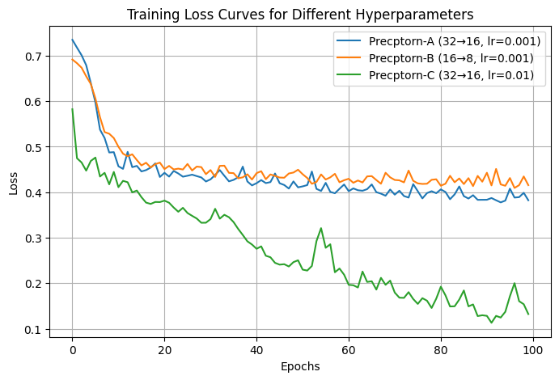

# Predicting Diabetes with a Multi-Layer Perceptron (PyTorch)

A PyTorch **MLP** classifier for the Pima Indians Diabetes dataset (768 patients, 8 clinical features), with a hyper-parameter comparison and a 3-page written report.

**Report:** [`report/Diabetes_MLP_Report.pdf`](report/Diabetes_MLP_Report.pdf)

## Method
- **Preprocessing**: median imputation of physiologically impossible zeros, `StandardScaler`, train / test split (154 test rows).
- **Model**: two hidden layers (32 and 16 units), ReLU, sigmoid output; binary cross-entropy loss; Adam (lr 0.001), batch size 32, 100 epochs.
- **Experiments**: three configurations compared on the same split.

## Results
| Model | Hidden units | LR | Test accuracy |
|---|---|---|---|
| A | 32 to 16 | 0.001 | **0.747** |
| B | 16 to 8 | 0.001 | 0.708 |
| C | 32 to 16 | 0.01 | **0.747** |

For model A: accuracy 0.73 in the classification report, with **recall 0.59 on the diabetic class** (confusion matrix `[[78, 18], [24, 34]]`): the model misses many diabetic cases because the data is imbalanced (about 65% non-diabetic).

Model B under-fits. Model C reaches the same test accuracy while its training loss falls far lower and is noisier, which suggests over-fitting rather than a better model.

**Limitations.** Small dataset, a single split (no cross-validation or confidence intervals), accuracy used as the headline metric despite class imbalance, no class weighting or threshold tuning. These are the obvious next steps.

## Skills demonstrated
PyTorch, MLPs, preprocessing and scaling, hyper-parameter experimentation, classification metrics (precision / recall / confusion matrix), clinical tabular data, scientific reporting.

## Run
`pip install -r requirements.txt`; add the course-supplied `train_data.csv` and `test_data.csv` (not included) next to the notebook.

## Context
Built as an individual assessment for *Deep Learning Fundamentals* in the MSc in Artificial Intelligence & Machine Learning at the University of Adelaide (Trimester 3, 2025). Task text embedded in the notebook is the course template; the implementation and write-up are my own. Course datasets and material zips are not redistributed.

## Licence
MIT. See [LICENSE](LICENSE).
